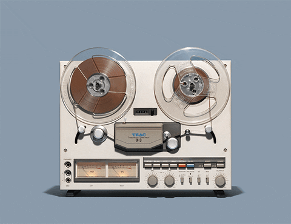

<h1>
Running-Tape

</h1>

Hello friend!  
The purpose of this Python script is to **schedule your PC to record a radio show or podcast** with ease.

---

## 📦 Requirements

- Python 3

---

## 🔧 Setup Instructions

1. Install Python 3.
2. Fill in the `Radio_Stns.csv` file with your favorite stations using the following format:

| Column     | Description                                                                 |
|------------|-----------------------------------------------------------------------------|
| `Radio_Stn` | A **unique name** for your beloved station (used as a lookup index).        |
| `URL`      | The byte stream URL for the station (see below for how to find it).         |

---

## 🚀 How to Use

1. Run `main.py`.
2. Choose your station and click **Submit**.
3. Enter start and end times (in 24-hour format).
4. Click **Set Time** to schedule the recording.

> The recording will be saved in the `downloads/` folder inside the script’s directory.
> Note: If you enter a time that already passed, it will schedule for tomorrow. 

---

## 📁 File Overview

| File             | Description                                                                 |
|------------------|-----------------------------------------------------------------------------|
| `buffer.txt`      | Contains a single integer (in seconds) to check on each buffer. Default is `1`. |
| `get_connect.py`  | Establishes connection to the stream URL.                                 |
| `main.py`         | Launches the interface for station selection and time scheduling.         |
| `Radio_Stns.csv`  | CSV containing your favorite radio stations.                              |
| `radio_type.py`   | Detects the stream type based on the URL.                                 |
| `recorders.py`    | The core bitstream downloader (like a tape recorder).                     |
| `set_recorder.py` | Handles user input for start/end times.                                   |
| `timer.py`        | Countdown logic to trigger recording at the right moment.                 |

---

## 🎵 m3u8 Stream Notes

- For `.m3u8` playlist streams, expect a few extra seconds of recording.
- The script checks the playlist every second (default `buffer = 1`).
- Some stations (e.g., **Kiss 92.5**) use 30-second playlist chunks, so 1 second is fine.
- Need more precision? Change the `buffer` to a float (see line 42 of `recorders.py`).

---

## 🔍 How to Find a Radio Stream URL

1. Visit the radio station’s website.
2. Open the browser dev tools (right-click > Inspect).
3. Go to the **Network** tab.
4. Play the live radio.
5. Look for a streaming feed (often `.m3u8`, not `.mp3` or `.aac`).
6. Test the URL in **VLC Media Player**:
   - Media > Open Network Stream
   - Paste the URL
   - It should **play continuously**.

> If it doesn’t loop, you’ve probably grabbed a playlist item, not the playlist itself. Keep digging!

---

## 💡 Tip

Have fun!
Okay, maybe not relevant to the repo—but it *is* good life advice. 😉

---

## 📜 License

[MIT](LICENSE) – do what you will, just don’t sue me.

